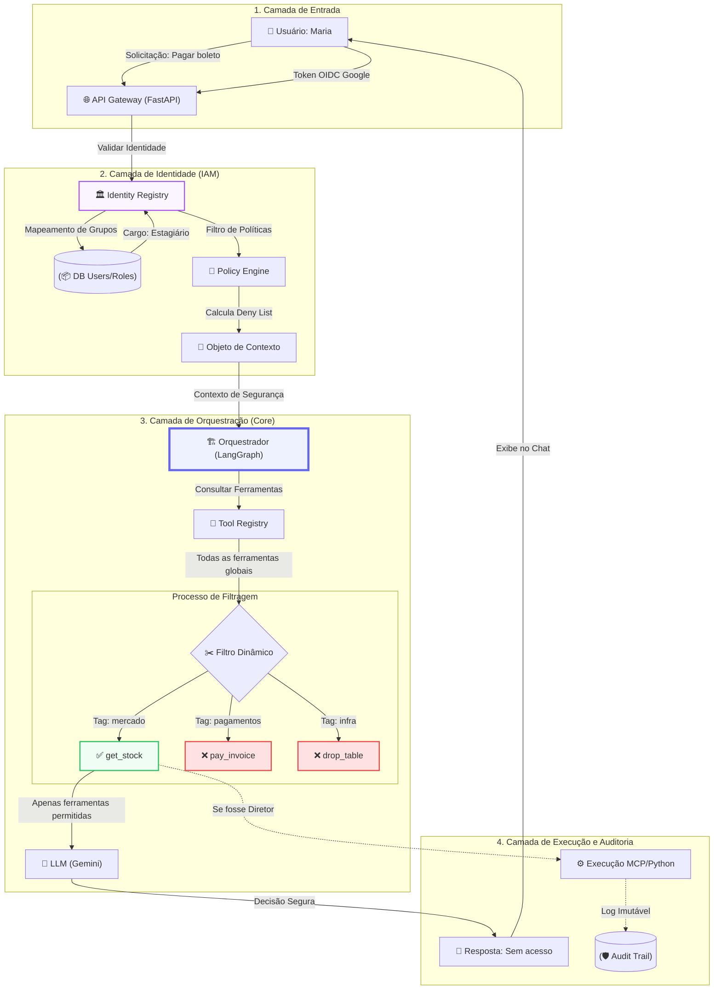

# <span style="color: #6366f1;">Arquitetura Detalhada: Fluxo de Permissões e IAM Nexus</span>

Este documento detalha o funcionamento interno do sistema de controle de acesso (IAM) do Nexus, desde a entrada do usuário até a execução segura de ferramentas.

---

## 🗺️ Visão Geral do Fluxo



---

## 🛠️ Detalhamento das Etapas

### 1. Mapeamento de Grupos (Identity Registry)
O sistema traduz quem o usuário é no **Google Workspace** para quem ele é no **Nexus**.

<div style="overflow-x: auto;">
<table style="width: 100%; border-collapse: collapse; margin: 1rem 0; border: 1px solid #e2e8f0; border-radius: 8px; overflow: hidden;">
  <thead>
    <tr style="background-color: #f8fafc;">
      <th style="padding: 12px; text-align: left; border-bottom: 1px solid #e2e8f0;">Origem (Google Group)</th>
      <th style="padding: 12px; text-align: left; border-bottom: 1px solid #e2e8f0;">Destino (Nexus Role)</th>
      <th style="padding: 12px; text-align: left; border-bottom: 1px solid #e2e8f0;">Nível de Acesso (Escopo)</th>
    </tr>
  </thead>
  <tbody>
    <tr>
      <td style="padding: 12px; border-bottom: 1px solid #f1f5f9;">financeiro-estagiarios@</td>
      <td style="padding: 12px; border-bottom: 1px solid #f1f5f9;"><b style="color: #64748b;">Estagiário</b></td>
      <td style="padding: 12px; border-bottom: 1px solid #f1f5f9;">Somente leitura / consultas básicas</td>
    </tr>
    <tr style="background-color: #f8fafc;">
      <td style="padding: 12px; border-bottom: 1px solid #f1f5f9;">financeiro-analistas@</td>
      <td style="padding: 12px; border-bottom: 1px solid #f1f5f9;"><b style="color: #4f46e5;">Analista</b></td>
      <td style="padding: 12px; border-bottom: 1px solid #f1f5f9;">Edição de planilhas / consultas de balanço</td>
    </tr>
    <tr>
      <td style="padding: 12px; border-bottom: 1px solid #f1f5f9;">diretoria@</td>
      <td style="padding: 12px; border-bottom: 1px solid #f1f5f9;"><b style="color: #1e293b;">Diretor</b></td>
      <td style="padding: 12px; border-bottom: 1px solid #f1f5f9;">Acesso total / aprovações financeiras</td>
    </tr>
    <tr style="background-color: #f8fafc;">
      <td style="padding: 12px; border-bottom: 1px solid #f1f5f9;">ti-admin@</td>
      <td style="padding: 12px; border-bottom: 1px solid #f1f5f9;"><b style="color: #0f172a;">Admin</b></td>
      <td style="padding: 12px; border-bottom: 1px solid #f1f5f9;">Gerenciamento de infraestrutura / logs</td>
    </tr>
  </tbody>
</table>
</div>

---

### 2. Motor de Políticas (Policy Engine)
O Policy Engine decide o que o cargo **NÃO PODE** fazer (Deny List).

<div style="background-color: #fff7ed; border-left: 4px solid #f97316; padding: 1rem; margin: 1rem 0; border-radius: 4px;">
  <b style="color: #9a3412;">Conceito Chave:</b> O Nexus adota uma estratégia de <b>Segurança por Omissão</b>. Ferramentas não permitidas sequer são injetadas no contexto do LLM.
</div>

<div style="overflow-x: auto;">
<table style="width: 100%; border-collapse: collapse; margin: 1rem 0; border: 1px solid #e2e8f0; border-radius: 8px; overflow: hidden;">
  <thead>
    <tr style="background-color: #f8fafc;">
      <th style="padding: 12px; text-align: left; border-bottom: 1px solid #e2e8f0;">Cargo (Role)</th>
      <th style="padding: 12px; text-align: left; border-bottom: 1px solid #e2e8f0;">Categorias Bloqueadas (Deny Tags)</th>
      <th style="padding: 12px; text-align: left; border-bottom: 1px solid #e2e8f0;">Ferramentas Bloqueadas (Deny Tools)</th>
    </tr>
  </thead>
  <tbody>
    <tr>
      <td style="padding: 12px; border-bottom: 1px solid #f1f5f9;"><b>Estagiário</b></td>
      <td style="padding: 12px; border-bottom: 1px solid #f1f5f9;"><span style="color: #ef4444;">pagamentos, infra, seguranca</span></td>
      <td style="padding: 12px; border-bottom: 1px solid #f1f5f9;"><code>search_salary</code></td>
    </tr>
    <tr style="background-color: #f8fafc;">
      <td style="padding: 12px; border-bottom: 1px solid #f1f5f9;"><b>Analista</b></td>
      <td style="padding: 12px; border-bottom: 1px solid #f1f5f9;"><span style="color: #f97316;">infra, seguranca</span></td>
      <td style="padding: 12px; border-bottom: 1px solid #f1f5f9;"><code>pay_invoice</code> (apenas consulta)</td>
    </tr>
    <tr>
      <td style="padding: 12px; border-bottom: 1px solid #f1f5f9;"><b>Diretor</b></td>
      <td style="padding: 12px; border-bottom: 1px solid #f1f5f9;">(Nenhuma)</td>
      <td style="padding: 12px; border-bottom: 1px solid #f1f5f9;">(Nenhuma)</td>
    </tr>
    <tr style="background-color: #f8fafc;">
      <td style="padding: 12px; border-bottom: 1px solid #f1f5f9;"><b>Admin</b></td>
      <td style="padding: 12px; border-bottom: 1px solid #f1f5f9;"><span style="color: #0284c7;">financeiro</span> (segregação de funções)</td>
      <td style="padding: 12px; border-bottom: 1px solid #f1f5f9;">(Nenhuma)</td>
    </tr>
  </tbody>
</table>
</div>

---

### 3. Objeto de Contexto (O "Passaporte" da Requisição)
Este é o JSON gerado após o handshake de identidade que guia todo o fluxo de orquestração.

```json
{
  "user": {
    "id": "maria_01",
    "email": "maria@empresa.com",
    "role": "Estagiário"
  },
  "security": {
    "deny_tags": ["pagamentos", "infra", "seguranca"],
    "deny_tools": ["search_salary"],
    "allowed_scopes": ["consultas_basicas"]
  }
}
```

---

### 4. Filtro Dinâmico no Orquestrador
Comparação final executada pelo nó do Grafo antes do envio ao Modelo.

<div style="overflow-x: auto;">
<table style="width: 100%; border-collapse: collapse; margin: 1rem 0; border: 1px solid #e2e8f0; border-radius: 8px; overflow: hidden;">
  <thead>
    <tr style="background-color: #f8fafc;">
      <th style="padding: 12px; text-align: left; border-bottom: 1px solid #e2e8f0;">Ferramenta (Tool)</th>
      <th style="padding: 12px; text-align: left; border-bottom: 1px solid #e2e8f0;">Tag da Ferramenta</th>
      <th style="padding: 12px; text-align: left; border-bottom: 1px solid #e2e8f0;">Comparação com Maria</th>
      <th style="padding: 12px; text-align: left; border-bottom: 1px solid #e2e8f0;">Resultado para a IA</th>
    </tr>
  </thead>
  <tbody>
    <tr>
      <td style="padding: 12px; border-bottom: 1px solid #f1f5f9;"><code>get_stock</code></td>
      <td style="padding: 12px; border-bottom: 1px solid #f1f5f9;">mercado</td>
      <td style="padding: 12px; border-bottom: 1px solid #f1f5f9;">Não está na Deny List</td>
      <td style="padding: 12px; border-bottom: 1px solid #f1f5f9;"><b style="color: #16a34a;">Injetada</b> (Visível)</td>
    </tr>
    <tr style="background-color: #f8fafc;">
      <td style="padding: 12px; border-bottom: 1px solid #f1f5f9;"><code>pay_invoice</code></td>
      <td style="padding: 12px; border-bottom: 1px solid #f1f5f9;">pagamentos</td>
      <td style="padding: 12px; border-bottom: 1px solid #f1f5f9;"><span style="color: #ef4444;">Bloqueada (Tag)</span></td>
      <td style="padding: 12px; border-bottom: 1px solid #f1f5f9;"><b style="color: #dc2626;">Omitida</b> (Invisível)</td>
    </tr>
    <tr>
      <td style="padding: 12px; border-bottom: 1px solid #f1f5f9;"><code>drop_table</code></td>
      <td style="padding: 12px; border-bottom: 1px solid #f1f5f9;">infra</td>
      <td style="padding: 12px; border-bottom: 1px solid #f1f5f9;"><span style="color: #ef4444;">Bloqueada (Tag)</span></td>
      <td style="padding: 12px; border-bottom: 1px solid #f1f5f9;"><b style="color: #dc2626;">Omitida</b> (Invisível)</td>
    </tr>
    <tr style="background-color: #f8fafc;">
      <td style="padding: 12px; border-bottom: 1px solid #f1f5f9;"><code>search_salary</code></td>
      <td style="padding: 12px; border-bottom: 1px solid #f1f5f9;">rh</td>
      <td style="padding: 12px; border-bottom: 1px solid #f1f5f9;"><span style="color: #ef4444;">Bloqueada (Tool)</span></td>
      <td style="padding: 12px; border-bottom: 1px solid #f1f5f9;"><b style="color: #dc2626;">Omitida</b> (Invisível)</td>
    </tr>
  </tbody>
</table>
</div>

---

## 🏗️ Por que esta arquitetura funciona?

1.  <b style="color: #4f46e5;">Impossível de Hackear via Prompt:</b> Como as ferramentas proibidas sequer são enviadas para o Gemini, não há como o usuário persuadir a IA a executá-las.
2.  <b style="color: #4f46e5;">Segurança por Categoria:</b> Novas ferramentas herdam proibições automaticamente através das tags.
3.  <b style="color: #4f46e5;">Auditoria Completa:</b> O Objeto de Contexto é persistido, garantindo rastreabilidade total das permissões no momento da ação.

---
<div style="text-align: right; color: #94a3b8; font-size: 0.8rem;">
  Documentação gerada por Qkeq para Peterson - Nexus AI Architecture
</div>
