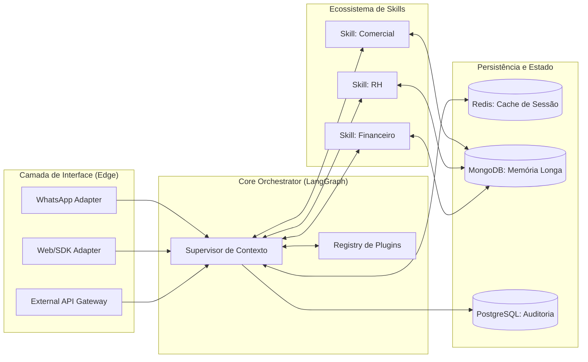

# Qorp Core: Arquitetura Sistêmica e Topologia de Dados

Este documento detalha a infraestrutura técnica e a topologia do sistema Qorp Core, focada em garantir escalabilidade horizontal, isolamento de domínios e soberania de dados.

---

## 1. Visão Geral da Arquitetura (GraphTD)

---

## 2. Topologia de Micro-Agentes (Stateless Architecture)

Diferente de sistemas de IA tradicionais que mantêm o estado em memória local, o Qorp Core utiliza uma arquitetura **100% Stateless**, permitindo escalabilidade infinita.

### A. O Cérebro (Core Orchestrator)
O motor central (LangGraph) atua como um coordenador de tarefas. Ele não possui lógica de negócio embutida; toda a inteligência específica é injetada via **Hot-Plug** a partir do Registry de Plugins.

### B. O Registry de Plugins (The Skills Hub)
Um repositório centralizado onde os manifestos JSON definem:
- **Capability Score:** O que o plugin sabe fazer.
- **Tool Access:** Quais APIs ele pode chamar.
- **Data Boundary:** Quais bancos de dados ele pode acessar.

### C. Isolamento de Domínio (Sandboxing)
Cada Skill (Especialista) opera em um contexto isolado. Se o Agente de RH falhar ou sofrer uma alucinação, o Core detecta o erro e retoma o controle sem afetar outros processos em execução.

---

## 3. Pilha Tecnológica (Enterprise Stack)

| Camada | Tecnologia | Papel Fundamental |
| :--- | :--- | :--- |
| **Orquestração** | **LangGraph** | Gestão de estado cíclico e tomada de decisão não linear. |
| **API Backend** | **FastAPI** | Interface de alta performance para comunicação assíncrona. |
| **Broker de Estado** | **Redis** | Gestão de checkpoints em tempo real para baixa latência. |
| **Memória Central** | **MongoDB Atlas** | Repositório de fatos, preferências e vetores (RAG). |
| **Governança** | **PostgreSQL** | Trilha de auditoria estruturada (compliance e custos). |
| **Observabilidade** | **LangFuse** | Tracing completo da cadeia de pensamento e métricas de LLM. |

---

## 4. Segurança e Fluxo de Dados (Data Governance)

O Qorp Core implementa uma política de **Menor Privilégio**:
1.  **Ingress Filter:** Filtra dados sensíveis (PII) antes de chegarem ao LLM.
2.  **RBAC para IA:** O Supervisor só carrega ferramentas para o Agente se o `user_role` do solicitante permitir.
3.  **Auditoria Imutável:** Todo pensamento e ação da IA é gravado em uma tabela de auditoria protegida (Postgres), garantindo que nada seja "esquecido" ou "alterado".

---

## 5. Estratégia de Escalabilidade
A arquitetura permite que os Workers do Core rodem em clusters **Kubernetes**, escalando automaticamente com base no volume de mensagens. Como o estado é externalizado no Redis/Mongo, qualquer Worker pode assumir qualquer turno de conversa a qualquer momento (Seamless Failover).

---
**Navegação:**
- [Blueprint de Funcionamento](./BLUEPRINT_FUNCIONAMENTO.md)
- [Contratos e Segurança](./CONTRATOS_E_SEGURANCA.md)
- [Estratégia de Implementação](./ESTRATEGIA_IMPLEMENTACAO.md)
