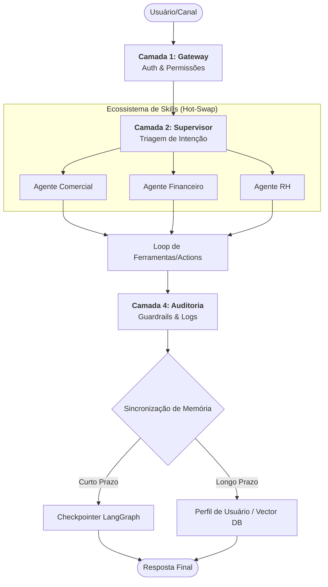

# Qorp Core: Blueprint de Funcionamento do Sistema

Este documento descreve a mecânica interna de funcionamento do Qorp Core, detalhando como o sistema processa uma requisição desde o primeiro contato até a entrega da solução final.

---

## 1. Fluxo Macro de Processamento (GraphTD)

---

## 2. A Jornada da Informação (Cascata de Decisão)

O funcionamento do Qorp Core não é uma linha reta, mas uma **cascata de inteligência** estruturada em 4 camadas de governança e execução:

### Camada 1: Gateway de Identidade e Segurança
Antes de qualquer processamento semântico, o sistema valida o perímetro.
- **Validação de Token:** Verifica a autenticidade da sessão (Web ou WhatsApp).
- **Injeção de Perfil (Context Injection):** O sistema busca no banco de dados quem é o usuário e, crucialmente, o que ele **NÃO** pode fazer.
- **Pre-flight Sandbox:** As ferramentas (Tools) são filtradas via código (Hard-check), impedindo que a IA tente usar recursos não autorizados mesmo que "queira".

### Camada 2: O Orquestrador de Domínios (The Supervisor)
O coração do sistema é o nó Supervisor, que atua como um triador inteligente.
- **Classificação de Intenção:** O Supervisor analisa se o pedido é transacional (ex: "tirar uma nota"), informativo (ex: "quais os benefícios?") ou de suporte.
- **Seleção de Skillset:** Com base na intenção, o sistema realiza o **Hot-Swap** do contexto, carregando o manifesto do plugin especialista (Comercial, RH, Financeiro) sem necessidade de reiniciar o serviço.

### Camada 3: Execução de Agente Especialista
Aqui ocorre o raciocínio profundo dentro do domínio escolhido.
- **Loop de Ferramentas (Action Loop):** O agente pode realizar múltiplas chamadas de ferramentas em sequência para resolver problemas complexos (ex: Consultar estoque -> Verificar crédito -> Gerar proposta).
- **Reflexão Interna:** O agente valida se o output da ferramenta resolve o problema do usuário antes de formular a resposta final.

### Camada 4: Auditoria e Persistência de Aprendizado
O fluxo encerra garantindo a soberania dos dados e a melhoria contínua.
- **Sanitização de Saída (Outbound Guardrails):** Verifica se dados sensíveis de um departamento não vazaram para outro.
- **Double-Sync de Memória:** 
    - **Curto Prazo:** Atualização do checkpoint do LangGraph para continuidade imediata.
    - **Longo Prazo:** Extração de fatos e preferências para o perfil permanente do usuário (User Profile Update).
- **Observabilidade Granular:** Envio de telemetria completa para o **LangFuse**, permitindo análise de custo e latência por etapa.

---

## 3. A Engrenagem Técnica (O que sustenta o Blueprint)

| Componente | Função | Diferencial Qorp |
| :--- | :--- | :--- |
| **StateGraph** | Motor de Fluxo | Permite ciclos de correção e retorno ao supervisor. |
| **Manifesto JSON** | Configuração de Plugin | Adição de novos domínios em runtime (Zero Downtime). |
| **Checkpointer** | Persistência de Estado | Retomada de conversas assíncronas (ex: WhatsApp) sem perda de contexto. |
| **Context Bridge** | Unificação Omnichannel | O usuário é o mesmo, independente se fala via Web ou Mobile. |

---

## 4. Resumo Executivo da Operação
O Qorp Core transforma uma mensagem bruta em uma **ação governada**. Ele não apenas responde; ele **identifica**, **autoriza**, **executa** e **audita**, garantindo que a inteligência artificial opere dentro dos limites corporativos com eficiência de especialista.

---
**Navegação:**
- [Visão Geral: Qorp Core](./VISAO_PRODUTO_CORE.md)
- [Arquitetura Sistêmica](./ARQUITETURA_SISTEMICA.md)
- [Contratos e Segurança](./CONTRATOS_E_SEGURANCA.md)
