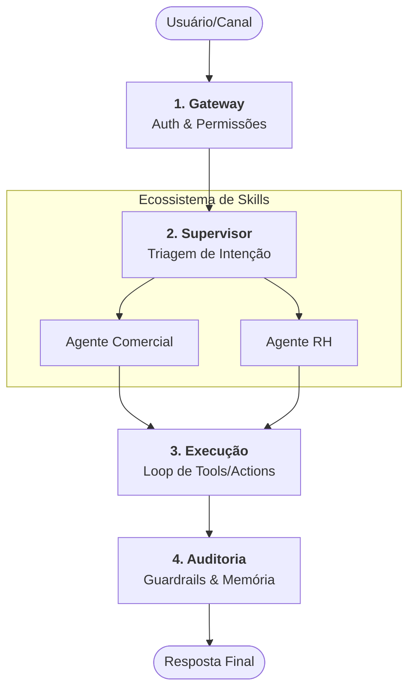

# Qorp Core - Documentação Consolidada (Base)

Este documento representa a base de conhecimento consolidada para o **Qorp Core**, o sistema operacional de Inteligência Artificial da empresa. Ele integra visão estratégica, arquitetura sistêmica, mecânica de funcionamento e diretrizes de expansão.

---

## 1. Visão e Conceito: O "AI-OS" Corporativo

O Qorp Core não é apenas um chatbot, mas um **orquestrador central de inteligência** (AI Operating System). Ele atua como o ponto de entrada único para diversas capacidades ("Skills") departamentais, garantindo governança, segurança e memória compartilhada.

### Pilares Fundamentais:
- **Núcleo Agnóstico:** O Core gerencia estado, identidade e segurança sem conhecer o domínio específico (Comercial, RH, etc.).
- **Sistema de Plugins (Skills):** Expansão Modular via manifestos JSON que injetam ferramentas e personas no sistema em runtime.
- **Omnichannel Nativo:** Unificação de identidade entre WhatsApp e Web, garantindo continuidade e contexto em qualquer canal.

---

## 2. Arquitetura Sistêmica e Fluxo de Execução

A arquitetura do Qorp Core é baseada em **Grafos de Estado Progressivos** (LangGraph), permitindo tomadas de decisão não lineares e ciclos de correção.

### Topologia de Dados
- **Camada de Orquestração:** LangGraph (Motores de decisão) e FastAPI (API Backend).
- **Gestão de Estado:** Redis (Checkpoints de sessão em tempo real).
- **Memória de Longo Prazo:** MongoDB Atlas (Fatos, preferências e RAG/Vetores).
- **Governança/Auditoria:** PostgreSQL (Trilha de auditoria imutável).
- **Observabilidade:** LangFuse (Tracing completo da cadeia de pensamento).

### O Blueprint de Funcionamento (4 Camadas)

1.  **Gateway:** Validação de identidade e injeção de perfil (permissões RBAC).
2.  **Supervisor:** Analisa a intenção e faz o **Hot-Swap** do contexto para o plugin especialista.
3.  **Execução:** O Agente Especialista processa o pedido usando ferramentas (APIs, CRM, SQL).
4.  **Auditoria:** Sanitização de saída (Guardrails) e sincronização de memória (curto e longo prazo).

---

## 3. Sistema de Plugins e Expansão (Manifesto)

A escalabilidade do sistema reside no **Manifesto de Plugin**, um contrato JSON que define:
- **Controle de Acesso:** Roles necessárias para ativar a Skill.
- **Perfil de Inteligência:** Persona e instruções específicas (Prompt Snippets).
- **Hot-Tools:** Ferramentas injetadas dinamicamente no grafo apenas para aquela Skill.
- **Agentic UI:** Comandos que a IA pode enviar para o Frontend (ex: PDF generation, filters).

Este modelo permite que novos departamentos (como Financeiro ou Logística) sejam integrados sem tocar no código central do orquestrador.

---

## 4. Segurança, Identidade e Governança

### RBAC para IA (Role-Based Access Control)
O sistema aplica a política de **Menor Privilégio**. Ferramentas e dados sensíveis são filtrados antes mesmo da IA "pensar", impedindo vazamentos transversais (ex: vendedor acessando dados de RH).

### Unificação Omnichannel
O Qorp Core resolve a fragmentação de identidade vinculando o `User_ID` corporativo ao `WhatsApp_ID` (MSISDN) via um handshake seguro. Isso permite:
- **Continuidade:** Começar uma tarefa no celular e terminar no desktop.
- **Revogação Instantânea:** Desativação centralizada de acesso em todos os canais.

---

## 5. Observabilidade e Gestão de Prompts

Através do **LangFuse**, o sistema ganha uma "Caixa Preta" para depuração e melhoria:
- **Tracing:** Visualização exata de qual nó do grafo foi executado.
- **Prompt Management:** Edição de prompts em tempo real (sem necessidade de deploy/restart).
- **Controle de Custos:** Atribuição granular de custos de tokens por departamento e usuário.

---

## 6. Roadmap para Versão de Produção (V1)

As próximas etapas críticas para a consolidação do sistema incluem:
1.  **Persistência Real:** Migração dos checkpointers in-memory para Postgres.
2.  **Lock de Sessão:** Sistema Redis para evitar processamentos duplicados (cliques duplos).
3.  **Guardrail Ativo:** Implementação de modelo secundário (Vigia) para auditoria outbound.
4.  **Hot-Reload:** Automatização completa da leitura de manifestos a partir da base de dados.

---
*Este documento consolida as visões técnicas e estratégicas presentes no diretório `content/`.*
