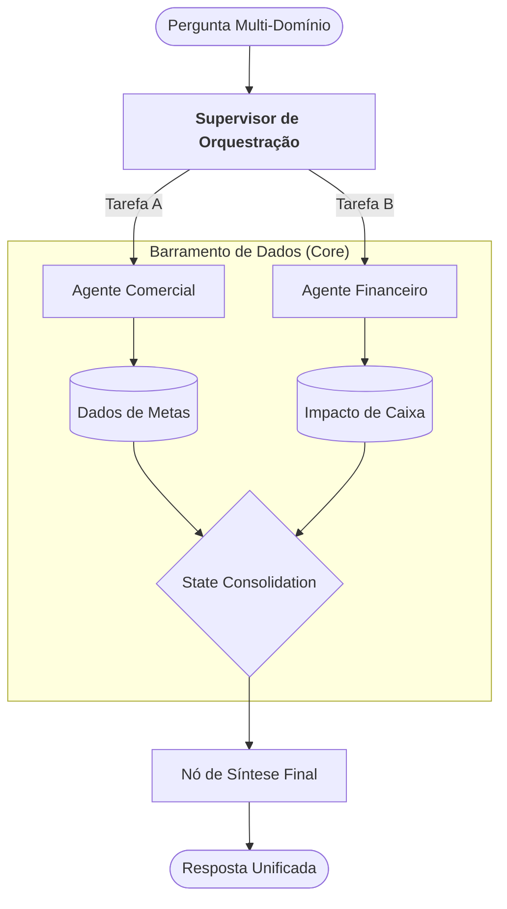

# Qorp Core: Gestão de Conflitos e Orquestração Multi-Plugin

Este documento detalha como o Qorp Core resolve situações de ambiguidade e colaboração entre diferentes domínios, garantindo que o sistema entregue respostas precisas mesmo quando uma tarefa exige o conhecimento de múltiplos especialistas.

---

## 1. O Desafio da Ambiguidade Departamental

Em um ambiente corporativo real, as perguntas raramente ficam isoladas em uma única "caixinha". À medida que o Qorp Core escala de uma tarefa específica para toda a empresa, surgem os **Pedidos Cross-Domain**.

**Exemplo de Conflito:** *"Como o aumento das metas de vendas em 20% impactará o bônus do time de logística?"*
- **Domínio Comercial:** Define as metas.
- **Domínio RH:** Define as regras de bônus.
- **Domínio Logística:** Define o escopo do time impactado.

---

## 2. Estratégias de Resolução do Core

O Qorp Core utiliza três níveis de resolução para garantir a fluidez da conversa sem comprometer a precisão:

### Nível 1: O Modelo de Colaboração (Shared State)
Nesta abordagem, o **Supervisor** atua como um mestre de cerimônias.
- Ele identifica que a pergunta exige dados de múltiplos plugins.
- Ele aciona as ferramentas de cada plugin em sequência, alimentando um **Estado Compartilhado (Shared State)**.
- Um nó final de síntese consolida as informações em uma única resposta coerente.
- **Ideal para:** Consultas analíticas e relatórios consolidados.

### Nível 2: Especialista Dominante com Cross-Call
O Supervisor identifica qual plugin é o "dono" do resultado final e delega a ele a liderança.
- O Agente Especialista líder tem permissão para disparar uma **Ferramenta de Consulta Externa** para outro plugin (via barramento do Core).
- **Ideal para:** Tarefas onde um setor depende de um dado pontual de outro para concluir uma ação.

### Nível 3: Clarificação Ativa (Human-in-the-Loop)
Se a ambiguidade for alta ou houver risco de segurança, o Core opta pela transparência.
- O sistema pergunta: *"Peterson, essa análise envolve dados de Vendas e RH. Você gostaria de ver o impacto direto no faturamento ou o detalhamento por colaborador?"*
- Isso evita que a IA tome decisões de roteamento erradas em questões críticas.

---

## 3. Segurança em Pedidos Mistos (The Redline)

A segurança do Qorp Core é **Atômica**. O fato de um usuário ter acesso ao Agente Comercial não dá a ele "passe livre" quando a pergunta envolve dados do Financeiro.

- **Regra de Ouro:** Se uma tarefa exige dados de dois plugins e o usuário só tem acesso a um, o sistema entrega apenas a parte autorizada.
- **Negative Feedback Elegante:** *"Consigo projetar o impacto das metas para você, mas os valores exatos de bônus são restritos ao RH. Deseja que eu use um valor médio estimado para a projeção?"*

---

## 4. Orquestração Visual (Mermaid)

---

## 5. Conclusão: Inteligência Colaborativa

A gestão de conflitos transforma o Qorp Core de uma "coleção de bots" em um **Ecossistema Inteligente**. O sistema não apenas sabe quem responde o quê, mas entende como os diferentes departamentos da empresa se interligam, fornecendo uma visão holística que sistemas de automação tradicionais não conseguem alcançar.

---
**Navegação:**
- [Especificação do Manifesto](./ESPECIFICACAO_MANIFESTO.md)
- [Arquitetura Sistêmica](./ARQUITETURA_SISTEMICA.md)
- [Guia de Sobrevivência IA](./GUIA_SOBREVIVENCIA_IA.md)
