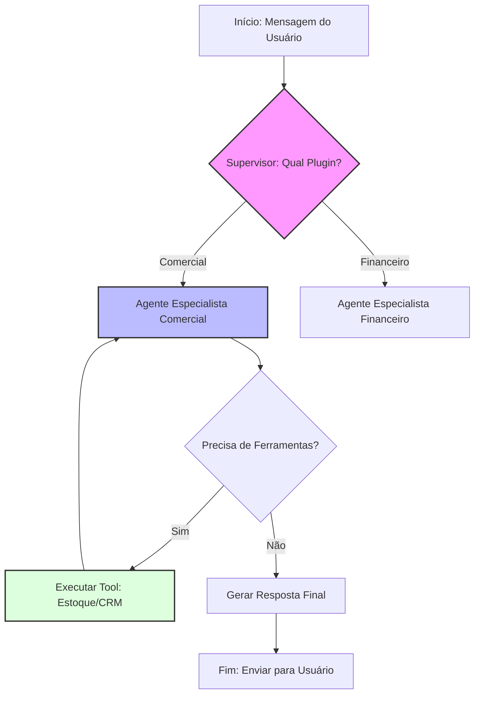

# Qorp Core - Guia de Introdução à Arquitetura de Agentes

Este guia detalha os pilares técnicos e conceituais do Qorp Core, servindo como base para desenvolvedores que precisam estender ou operar o sistema.

---

## 1. O Paradigma de Execução
Diferente do desenvolvimento de software tradicional onde o fluxo é 100% linear e previsível, o Qorp Core opera em um modelo híbrido.

### A. Estrutura Determinística (O Grafo)
O esqueleto do sistema é construído com **LangGraph**. Ele define os "nós" (etapas) e as "arestas" (caminhos). 
- O fluxo de "quem fala com quem" é código puro.
- Se o Supervisor decide que uma mensagem é `Comercial`, o grafo garante que ela vá para o nó `Especialista Comercial`. Isso é determinístico.

### B. Lógica Probabilística (O Modelo)
O que acontece dentro de cada nó é decidido por um **LLM**. 
- A resposta exata ou a escolha da ferramenta depende da interpretação da linguagem.
- **Conceito Chave:** Nós não programamos a resposta, nós programamos o **contexto** e as **regras de decisão** para que a IA gere a resposta.

---

## 2. Shared State: O Cérebro Compartilhado
Em uma arquitetura multi-agente, o maior desafio é a memória. O Qorp Core utiliza o conceito de **State Management** do LangGraph.
- **Redutores:** Mecanismos que decidem como novas informações são mescladas ao histórico (ex: adicionar mensagens vs. sobrescrever variáveis).
- **Checkpoints:** Cada interação é salva em um banco de dados. Se o sistema cair no meio de uma transação, he consegue retomar exatamente de onde parou, mantendo o contexto do lead.

---

## 3. Structured Outputs com Pydantic
Para que o código consiga "entender" a IA, utilizamos o **Pydantic**.
- Ao invés de pedir para a IA "retornar um JSON", nós passamos uma classe Python para o modelo.
- O modelo é forçado a preencher campos específicos (ex: `preco: float`, `produto: str`).
- Isso elimina o erro de "formato inválido" e permite que o Orquestrador tome decisões baseadas em dados tipados.

---

## 4. O Ciclo de Vida de uma Mensagem
1.  **Ingress:** A mensagem chega via API (WhatsApp/Web).
2.  **Supervisor de Acesso:** Verifica o `JWT` do usuário e decide quais plugins ele pode acessar.
3.  **Roteamento:** O Supervisor de IA lê o Manifesto do Sistema e escolhe o melhor especialista.
4.  **Loop de Ferramentas (Reasoning):** O especialista decide se precisa de dados externos.
5.  **Audit & Response:** A resposta passa por um filtro de segurança final antes de ser enviada e o rastro é gravado no Langfuse.

---

## 5. Tecnologias Essenciais para Estudo

Para dominar o Qorp Core, o foco deve estar nestas quatro verticais técnicas:

### A. Orquestração com LangGraph (Fundamental)
Esqueça as chains lineares. O LangGraph permite criar ciclos (loops) onde o agente pode tentar uma ação, errar, observar o erro e tentar novamente.

- **Conceitos:** Nodes, Edges, Conditional Edges e State.
- **Persistência:** Entender como o `TypedDict` define o que os agentes "sabem" uns dos outros e como os `Checkpointers` salvam o estado no banco.

### B. Observabilidade com Langfuse (CMS de Prompts)
O Langfuse resolve o maior problema de IA em produção: a visibilidade do que acontece "dentro da caixa".
- **Tracing:** Mapeamento completo de cada nó percorrido, latência e custo.
- **Prompt Management:** Centralização de prompts para atualização em tempo real (A/B testing e releases) sem necessidade de re-deploy.
- **Evals:** Uso de LLM-as-a-judge para dar notas automáticas de qualidade nas respostas.

### C. Estruturação de Dados com Pydantic
A ponte de segurança entre a linguagem natural e o código executável.
- **Schema Enforcement:** Garantia de que a IA só execute ferramentas se fornecer os parâmetros corretos.
- **Documentação de Tool:** Como o `Field(description="...")` é usado pela IA como um manual de instrução técnico para decidir quando chamar a ferramenta.

### D. RAG (Retrieval-Augmented Generation) & Vector DBs
A base de conhecimento externa que alimenta o especialista comercial.
- **Embeddings:** Conversão de documentos (PDFs de estoque, manuais) em vetores para busca semântica.
- **Vector Stores:** Operação com ChromaDB ou Pinecone para recuperação de contexto ultra-rápida.
- **Chunking Strategy:** Como quebrar textos grandes para que a IA não se perca no contexto.

### E. Camada de Serviço com FastAPI
Toda a inteligência é exposta via APIs assíncronas de alta performance.
- **Webhooks:** Integração com provedores de WhatsApp (Twilio/Evolution API).
- **Streaming:** Implementação de `StreamingResponse` para que o front-end receba a resposta da IA em tempo real.

---
**Navegação:**
- [O Que Falta?](./O_QUE_FALTA.md)
- [Análise de Riscos](./ANALISE_DE_RISCOS.md)
