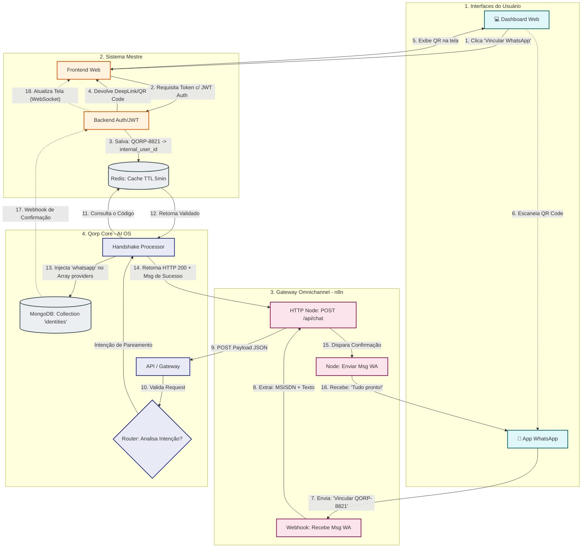

# Qorp Core: Arquitetura de Identidade e Handshake Omnichannel

**Data:** 04/03/2026
**Status:** Especificação Arquitetural Consolidada

Este documento define como o Qorp Core gerencia identidades, integra-se com múltiplos sistemas (Multi-Tenant) e mantém a segurança Omnichannel através de uma arquitetura híbrida de autenticação.

---

## 1. Princípio Fundacional: Dono do Cadastro vs. Dono do Mapa

A arquitetura do Qorp Core é estritamente desacoplada do gerenciamento de usuários. O Qorp funciona como um "AI-OS" e segue o princípio da Fonte Única de Verdade (SSOT).

* **O Sistema Mestre (Dono do Cadastro):** Sistemas como Metas, ERPs ou Painéis Administrativos são responsáveis pelo CRUD de usuários. Eles autenticam o usuário, definem senhas e ditam suas permissões corporativas.
* **O Qorp Core (Dono do Mapa):** Apenas reconhece a identidade e valida o acesso delegado pelo Sistema Mestre. Ele mantém a memória comportamental da IA atrelada a um identificador único, o **Internal UUID**.

---

## 2. Arquitetura Híbrida de Identidade

Para suportar múltiplos canais sem comprometer a segurança ou gerar complexidade excessiva, a autenticação é dividida em duas frentes:

### A. Cenário de Alta Confiança (Web/PC via JWT)
Ambientes logados utilizam tokens JWT assinados pelo Sistema Mestre (usando criptografia assimétrica RS256). 
* O Qorp valida a assinatura matematicamente via Chave Pública, sem consultar bancos de dados, garantindo zero latência.

### B. Cenário de Canais Externos (WhatsApp/n8n via Registry)
Gerar JWTs a cada mensagem no WhatsApp seria verboso e inviável.
* O n8n atua apenas como um "Carteiro Inteligente", enviando um HTTP POST simples contendo apenas o número do remetente e a mensagem.
* O Qorp consulta o **Identity Registry (IR)** no banco de dados, traduz o número de telefone para o `Internal UUID` e carrega o contexto completo do usuário.

---

## 3. Estrutura de Dados: Identity Registry

O Identity Registry é a tabela do MongoDB (`identities`) que unifica a identidade do usuário. Abaixo está o schema padrão, incluindo políticas de expiração de segurança para canais externos:

```json
{
  "internal_user_id": "qorp_u_8fb2c9",
  "name": "Peterson",
  "status": "active",
  "corporate_data": {
    "system_origin": "metas_v3",
    "email": "peterson@empresa.com"
  },
  "providers": [
    {
      "type": "web",
      "id": "metas_789",
      "verified": true,
      "last_seen": "2026-03-04T10:30:00Z"
    },
    {
      "type": "whatsapp",
      "id": "5511999999999",
      "verified": true,
      "paired_at": "2026-03-04T11:00:00Z",
      "expires_at": "2026-06-04T11:00:00Z" 
    }
  ],
  "access_control": {
    "role": "admin",
    "sector": "comercial",
    "scope": "comercial_full_access",
    "permissions": ["read_inventory", "write_sales"]
  },
  "preferences": {
    "origin_rules": {
      "whatsapp": { "limit_mcp": true, "concise_mode": true },
      "webchat": { "limit_mcp": false, "concise_mode": false }
    }
  }
}

```

---

## 4. O Fluxo de Handshake (Vinculação via Deep Link)

O processo de pareamento garante que o dono da conta corporativa é o mesmo dono do número de telefone, utilizando um fluxo de *Challenge-Response* otimizado para UX.

1. **Geração do Desafio (Web):** O usuário logado no Sistema Mestre clica em "Vincular WhatsApp". O sistema gera um código temporário de 6 dígitos (ex: `QORP-8821`), salva no Redis por 5 minutos atrelado ao `internal_user_id`, e exibe um QR Code.
2. **Ação do Usuário (Mobile):** O usuário escaneia o QR Code. O WhatsApp abre com a mensagem pré-preenchida (`Vincular QORP-8821`). O usuário a envia.
3. **Intermediação (n8n):** O n8n recebe a mensagem e a repassa para a API do Qorp, sem tentar interpretá-la.
4. **Validação (Qorp Core):** O Qorp cruza o código com o Redis. Ao validar, atualiza o Identity Registry, adicionando o número como um provedor `whatsapp` verificado.
5. **Confirmação:** O Qorp responde com sucesso via n8n: *"Tudo pronto! Agora eu te reconheço por aqui."*.

---

## 5. Escalabilidade Multi-Tenant (Múltiplos Sistemas)

O Qorp aceita novos sistemas utilizando isolamento criptográfico e de contexto.

* **Setup de Confiança:** O novo sistema gera um par de chaves e cadastra a Chave Pública no Qorp.
* **Injeção de Origem:** Ao assinar o JWT, o novo sistema adiciona sua origem (ex: `"system_origin": "novo_erp"`).
* **Context Switching:** O Qorp valida a assinatura e executa a "Troca de Skin", alterando as ferramentas ativas dinamicamente para garantir que dados de sistemas diferentes não se misturem.

---

## 6. Governança, Offboarding e Mitigação de Riscos

* **Offboarding Resiliente:** Quando um usuário é desativado no Sistema Mestre, um Webhook é enviado ao Qorp para revogar o acesso instantaneamente em todos os canais. O Sistema Mestre deve possuir uma *Dead Letter Queue (DLQ)* para reenvio em caso de falha de rede.
* **Reciclagem de Números (Operadoras):** Para evitar que números de telefone cancelados e revendidos repassem acessos indevidos, o campo `expires_at` força a revalidação periódica do vínculo do WhatsApp.
* **Proteção contra Força Bruta:** O endpoint de Handshake possui *Rate Limiting* rigoroso e tempo de vida restrito (TTL de 5 min) no Redis.

---

## 7. Diagrama Arquitetural do Handshake Omnichannel



