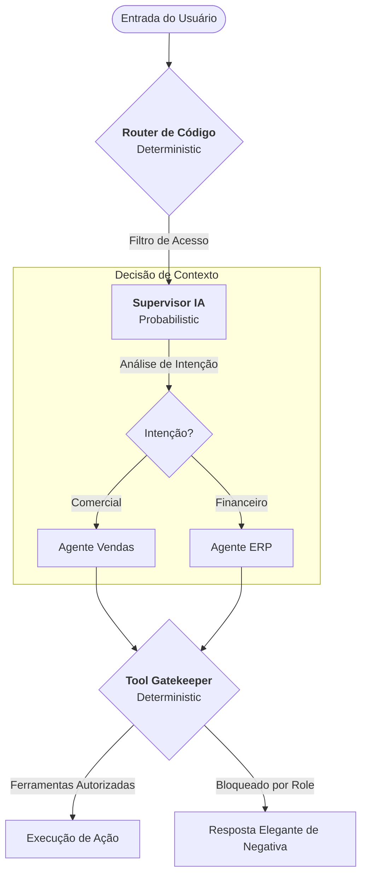

# Qorp Core: Supervisor vs. Orquestrador — A Inteligência do Fluxo

Este documento analisa o coração da tomada de decisão do Qorp Core: como balancear a fluidez da IA (Supervisor) com a rigidez necessária da lógica de negócios (Orquestrador).

---

## 1. O Dilema da Inteligência: Fluidez vs. Controle

Sistemas de IA de primeira geração sofrem de um "muro de rigidez": ou são chatbots livres e perigosos, ou são fluxos fixos que parecem árvores de decisão antigas (URA).

### A. O Orquestrador Determinístico (Tradicional)
- **Como funciona:** Baseado em regras fixas (IF/THEN).
- **Vantagem:** Segurança absoluta. O código não alucina.
- **Desvantagem:** Experiência de usuário (UX) pobre. Não lida com ambiguidades ou solicitações multi-domínio.

### B. O Supervisor Probabilístico (IA Pura)
- **Como funciona:** Uma IA central decide tudo o que acontece.
- **Vantagem:** Conversação natural e alta capacidade de síntese.
- **Desvantagem:** Vulnerável a *Prompt Injection* e inconsistência em decisões críticas.

---

## 2. A Resposta Qorp: O Modelo Híbrido (Guided Autonomy)

No Qorp Core, não escolhemos um lado. Criamos uma estrutura de **Autonomia Guiada**, onde a IA propõe o caminho, mas o código valida a passagem.

---

## 3. Pilares da Decisão Híbrida

### 1. Roteamento Suave (Soft Routing)
A IA Supervisor identifica o domínio, mas o sistema carrega o Agente Especialista de forma isolada. Isso evita que o Agente de RH tenha acesso ao prompt ou ferramentas do Agente Financeiro, reduzindo drasticamente o risco de vazamento de contexto.

### 2. O Tool Gatekeeper (Cinto de Segurança)
Mesmo que um Agente Especialista tente usar uma ferramenta (por alucinação ou manipulação do usuário), o Qorp Core possui uma camada de **Segurança por Omissão**. As ferramentas não são apenas "escondidas", elas não são injetadas no contexto de execução se o `user_role` não permitir.

### 3. Context Awareness (Consciência Situacional)
Diferente de um firewall cego, o Supervisor utiliza o histórico e o perfil do usuário para entender a nuance. Se um Gerente pede dados sensíveis, o sistema entende a legitimidade; se um Vendedor faz o mesmo pedido, o Supervisor nega de forma cordial, explicando o motivo dentro do contexto da conversa.

---

## 4. Conclusão: Inteligência Assistida por Rigidez

A filosofia do Qorp Core é que **a IA deve decidir a rota, mas o código deve construir os trilhos**. 

Essa abordagem garante que o sistema seja percebido pelo usuário como um assistente inteligente e flexível, enquanto os administradores têm a certeza matemática de que as permissões de acesso e as regras de negócio serão rigorosamente seguidas.

---
**Navegação:**
- [Visão de Produto Core](./VISAO_PRODUTO_CORE.md)
- [Supervisor de Acesso](./RASCUNHO_SUPERVISOR_ACESSO.md)
- [Contratos e Segurança](./CONTRATOS_E_SEGURANCA.md)
