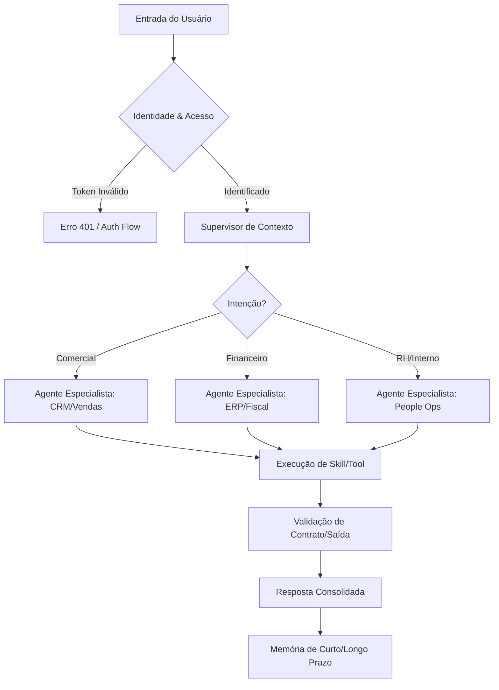

# Proposta Conceitual: Qorp Core - O "CRM" de IA

Este documento descreve a visão arquitetural para transformar o protótipo Qorp em um sistema de IA de nível empresarial, modular e agnóstico.

---

## 1. O Conceito: IA como Sistema Operacional (AI-OS)
Em vez de um chatbot isolado, o Qorp Core funcionará como um orquestrador central que gerencia identidades, permissões e roteamento para "Especialistas" (Agentes de Domínio).

### Pilares:
- **Core Agnóstico:** O núcleo não conhece o setor (Comercial, RH, ADM). Ele gerencia apenas o estado, a memória e a segurança.
- **Plugins de Domínio (Skills):** Cada setor é um "Plugin" que injeta ferramentas e prompts específicos no Core.
- **Multicanal (Omnichannel):** O Core processa a lógica, mas os adaptadores (WhatsApp, Web, Slack) são independentes.

---

## 2. Fluxo de Decisão (GraphTD)

---

## 3. Arquitetura Modular de Agentes

### Nível 1: O Orquestrador (The Router)
- Responsável por receber a mensagem.
- Identifica a intenção e o **Nível de Acesso** do usuário.
- Roteia para o agente especialista correto.

### Nível 2: Agentes Especialistas (Domain Experts)
- **Agente Comercial:** Conecta no CRM, consulta estoque, gera propostas.
- **Agente ADM/Financeiro:** Consulta NFs, fluxo de caixa, boletos.
- **Agente RH:** Dúvidas sobre benefícios, banco de horas.

---

## 4. Segurança e Níveis de Acesso (RBAC para IA)
Para produção, a IA precisa respeitar hierarquias.
- **Identidade:** Cada usuário tem um `role` (ex: `vendedor`, `gerente`, `admin`).
- **Filtragem de Ferramentas:** O Grafo só libera o nó de `finance_tools` se o `role == 'admin'`.
- **Data Sandboxing:** A memória de longo prazo é isolada por organização/departamento.

---

## 5. Evolução da Stack Técnica

| Componente | Protótipo (Qorp) | Produção (Qorp Core) |
| :--- | :--- | :--- |
| **Orquestração** | LangGraph (Grafo Único) | **Multi-Agent StateGraph** (Supervisores) |
| **Banco de Dados** | MongoDB (Checkpoints) | **PostgreSQL/Redis** (Escalabilidade de Sessão) |
| **Memória** | Fatos em Texto | **Vector DB (Pinecone/Weaviate)** para RAG |
| **Segurança** | .env simples | **JWT + API Gateway** (Auth0/Supabase) |
| **Integração** | Ferramentas locais | **MCP Enterprise** (Servidores de Ferramentas) |

---

## 6. Governança e Observabilidade
Diferente de sistemas legados, o Qorp Core exige monitoramento em tempo real do "pensamento" da IA:
- **Trilha de Auditoria:** Log completo de qual Skill foi acionada e por que.
- **Custos por Usuário:** Atribuição granular de tokens consumidos por departamento.
- **Feedback Loop:** Interface para humanos corrigirem rotas erradas do supervisor.

---
**Documentos Relacionados:**
- [Estratégia do Supervisor de Acesso](./RASCUNHO_SUPERVISOR_ACESSO.md)
- [Supervisor vs Orquestrador](./RASCUNHO_SUPERVISOR_ORQUESTRADOR.md)
- [Contratos de Plugin e Segurança](./CONTRATOS_E_SEGURANCA.md)
- [Especificação do Manifesto de Plugin](./ESPECIFICACAO_MANIFESTO.md)
- [Gestão de Conflitos entre Plugins](./GESTAO_CONFLITOS.md)
- [Arquitetura Sistêmica e Fluxo de Dados](./ARQUITETURA_SISTEMICA.md)
- [Lacunas Críticas (O Que Falta?)](./O_QUE_FALTA.md)
- [Dashboard de Auditoria e Governança](./DASHBOARD_AUDITORIA.md)
- [Estratégia LangFuse e Observabilidade](./ESTRATEGIA_LANGFUSE.md)
- [Soberania de Dados: LangFuse Self-Hosted](./LANGFUSE_SELF_HOSTED.md)
- [Análise de Riscos e Trade-offs](./ANALISE_DE_RISCOS.md)
- [Estimativa de Latência e Otimização](./ESTRATEGIA_IMPLEMENTACAO.md)
- [Estratégia de Implementação Progressiva](./ESTRATEGIA_IMPLEMENTACAO.md)
- [Plano de Transição: n8n para Qorp Core](./PLANO_TRANSICAO_COMERCIAL.md)
- [Interpretação de Contexto Visual e Dados de Tela](./INTERPRETACAO_DE_CONTEXTO_VISUAL.md)
- [Unificação de Identidade: WhatsApp <=> Web](./UNIFICACAO_DE_IDENTIDADE.md)
